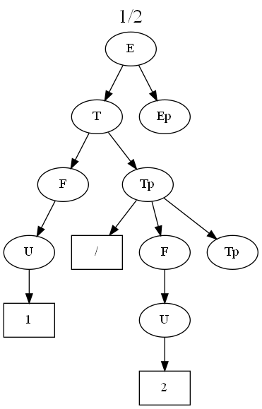

# mathparser
Simple expression parser

## Overview
This is a header-only library for parsing math expressions to produce a numeric result.  It will also generate the parse tree for the expression as a graphviz script, to produce diagrams like this:

<p align="center"></p>

There are three classes in the library:
1. Parser: Implements a left-recursion-factored, top-down recursive descent parser for an expression grammar.  Includes actions to do the math operations at the appropriate points with values pulled from a stack;
2. Lexer: Simple brute-force expression scanner;
3. MathStack: Simple push-pop stack of floats for use by the parser actions.

The grammar implemented by Parser is this:

$$ E \to T E' $$

$$ E' \to + T E' \mid  \epsilon $$

$$ T \to F T' $$

$$ T' \to * F T' \mid  \epsilon $$

$$ F  \to ( E ) \mid  U $$

$$ U  \to + num \mid - num \mid  num $$

Actions embedded in the production logic push operators onto a stack, and pop them off to do math ops, and push the results back on the stack so math is done with the defined precedences in the equation.

mathparser.cpp implements a command-line program to demonstrate the library, is executed like this:

    $ ./mathparser "1/2" 
    0.5

to produce the answer to the equation, and like this:

<table border=0> <tr><td valign="top">
  <pre>
$ ./mathparser -g "1/2"
digraph G {
    label = "1/2"
    labelloc  =  t
    fontsize = 20   E0[label="E"];
    T0[label="T"];
    F0[label="F"];
    U0[label="U"];
    tok0 [shape=box,label="1"];
    Tp0[label="Tp"];
    tok1 [shape=box,label="/"];
    F1[label="F"];
    U1[label="U"];
    tok2 [shape=box,label="2"];
    Tp1[label="Tp"];
    Ep0[label="Ep"];
    E0 -> T0;
    T0 -> F0;
    F0 -> U0;
    U0 -> tok0;
    T0 -> Tp0;
    Tp0 -> tok1;
    Tp0 -> F1;
    F1 -> U1;
    U1 -> tok2;
    Tp0 -> Tp1;
    E0 -> Ep0;
}
  </pre>
</td>
<td>
<pre>
  $ dot -Tpng graph1.txt -o graph1.png
</pre>

</td></tr></table>

to make the script and produce the graph.

## Building the Code

Very simple cmake build:

    mkdir build
    cd build
    cmake ..
    make

gets you a ```mathparser.exe``` (or ```mathparser```, in unix).

Most any recent C++ compiler should work, depends only on the standard library.

## License

The code and text in this repository is Copyrighted 2023 by Glenn Butcher.  I assigned the LGPL 2.0 license, appropriate to a library, feel free to use it within that licenses terms and conditions.


 


